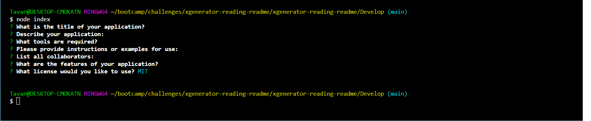

# <XGenerator-Readme.md>

## Description

- As a USER I wanted to create a Readme dynamically

- This project was built to make life easier by taking the heavy lifting off of the user and creating a reusable template for multiple uses.

- This project does not completely solve the time contraint but  does gives several of the minutes used back to the user. 

- I learned a way to dynamically generate the readme and how to use the 'require' and the inquirer dependency

## Video
![link to video]<video src="Develop/utils/video/xgenerator-reading-readme%20-%20Visual%20Studio%20Code%202024-01-26%2001-00-58.mp4" controls title="Title"></video>
## Screenshots

## Repository Clone
gh repo clone <https://Brazz26/xgenerator-reading-readme>